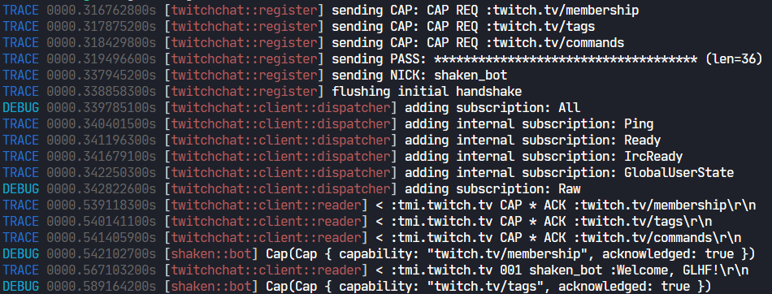
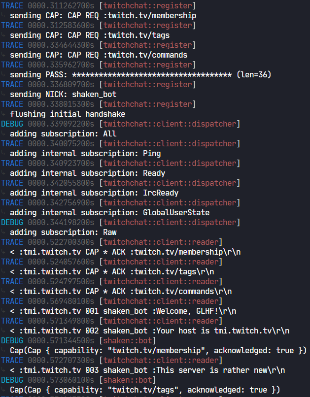

# alto_logger

## filtering
use the environmental variable `RUST_LOG` with `module_name=level`

> RUST_LOG="tokio=warn,my_module=info,my_module::inner=trace"


## output
#### single line
```rust
alto_logger::init(Style::SingleLine, ColorConfig::default()).unwrap();
```


#### multiple lines
```rust
alto_logger::init(Style::MultiLine, ColorConfig::default()).unwrap();
```


